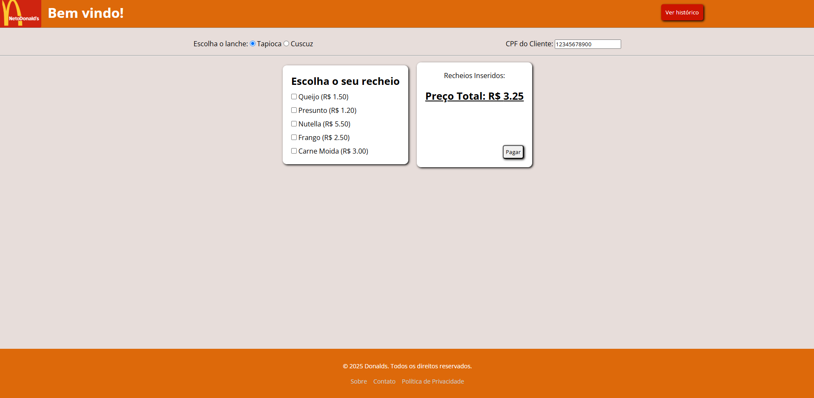

# Projeto Donalds
esse projeto foi desenvolvido com base nas aulas de programação web do curso de ADS, nele foi utilizado a abordagem FullStack, ou seja, usando Banco de Dados (pgAdmin), juntamente do Back-End e o Front-End.
o projeto consiste na criação de um site de vendas de alimentos onde pode se escolher entre duas comidas tapioca e cuscuz, e selecionar os recheios que você deseja, e no final o historico da comprar e salvado e pode ser visualizado caso o cliente deseje.

## Design do Projeto

## Funcionalidades

- [X] Filtra os alimentos
- [X] Filtra os recheios
- [X] Possui um input para colocar o CPF do Cliente
- [X] Preço total da comida
- [X] Botão de pagamento que envia as informações da compra para o banco de dados
- [X] Histórico que mostra as compras relacionadas ao CPF do Cliente

## Contatos

Email: guilhermesilva2022.gs@gmail.com
